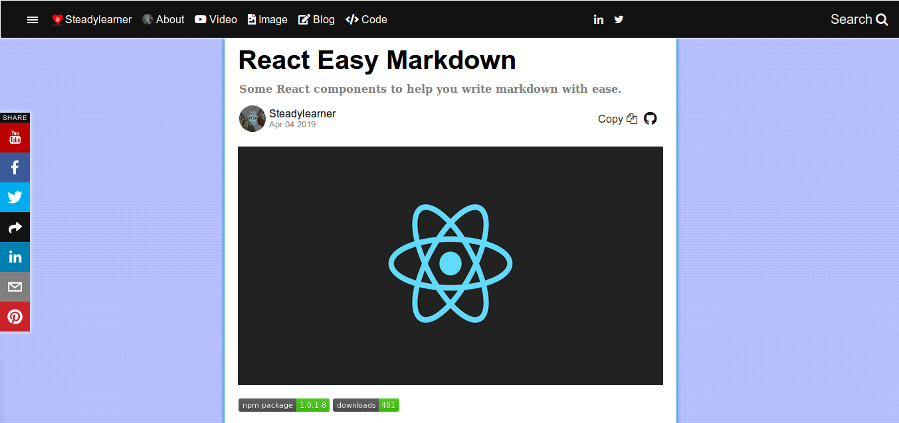

<!-- Shortcut -->

[react-marked-markdown]: https://github.com/Vincent-P/react-marked-markdown
[React Easy Markdown Github Repository]: https://github.com/steadylearner/react-easy-md
[examples]: https://github.com/steadylearner/react-easy-md/tree/master/examples
[Codesandbox for react-easy-md]: https://codesandbox.io/s/wz9pp1xpn8
[How to enable code syntax highlight in React App]: https://medium.com/@steadylearner/how-to-enable-code-syntax-highlight-in-react-app-38463498fa6e
[How to write less code for links in markdown with React]: https://www.steadylearner.com/blog/read/How-to-write-less-code-for-links-in-markdown-with-React
[marked]: https://github.com/markedjs/marked

<!-- \Shortcut -->

<!-- Steadylearner -->

[Steadylearner]: https://www.steadylearner.com/
[Blog]: https://www.steadylearner.com/blog
[Markdown]: https://www.steadylearner.com/markdown
[prop-passer]: https://www.npmjs.com/package/prop-passer

<!-- \Steadylearner -->

<!-- []() -->

 [](https://badge.fury.io/js/react-easy-md) [](https://img.shields.io/npm/dt/react-easy-md.svg)

# React Easy Markdown(react-easy-md)

Write Markdown with React easily with some JavaScript modules for it.

---

<!-- It turns it to absolute path at NPM -->

<!-- Use main image later -->
<!-- [](https://github.com/steadylearner/react-easy-md/tree/master/examples/react-easy-markdown-example) -->

This is forked version of [react-marked-markdown]. But the differences are

1. It solved the problem of showing `null` title.
2. `set` prop is included for **MarkdownPreview** to help you write shortcuts for `<a>` inside markdown.
3. The modules used here became funtional components.
4. LiveMarkdownEditor is removed from the package to reduce package size(Refer to [example code][examples] from [Markdown Editor Page][Markdown] at [Steadylearner][Steadylearner] instead.)
5. **API** such as **copy(ToClipBoard)**, **html**, **makrdown**, **readLocalFileWithHow** and **saveTextFromWeb** to help you handle .md file.

The original Github repository is archived so this package was made to share the code from the former repository with some improvements.

[Steadylearner] uses markdown intensively and it may have more features later.

To explain more about `1.`, You can define title for links with the syntax below

```md
[Website](https://www.steadylearner.com/ "Website")
```

But having default value solves the problem of showing **null** title when users forget to define it or when third party data doesn't have it.

## Install

1. Type `$npm install --save react-easy-md` or `$yarn add react-easy-md` in your **CLI**

2. Then,import component(s) you want

```js
import {
  MarkdownInput,
  MarkdownPreview,
  //
  html,
  markdown,
  copy,
  readLocalFileWithHow,
  saveTextFromWeb,
} from 'react-easy-md';
```

## Version Specific

1. Main image for react-easy-md and it will be the last main update for it.
2. **set** will be used for shorcut and links.

## Demo

1. [Live Example at Steadylearner][Markdown]

2. [Steadylearner Blog Posts](https://www.steadylearner.com/blog)

3. [CRA example][examples]

[](https://github.com/steadylearner/react-easy-md/tree/master/examples/react-easy-markdown-example)

[](https://www.steadylearner.com/blog/read/React-Easy-Markdown)

## Example

```js
// index.js
import React from "react";
import ReactDOM from "react-dom";
import { MarkdownPreview, copy } from "react-easy-md";

const example = "## React Easy Markdown"

function App() {
  return (
    <section className="App">
      <MarkdownPreview
        value={markdown(html(example))}
        markedOptions={{
          langPrefix: "hljs ", // 1.
          sanitize: false, // // 2.
          breaks: true, // 3.
        }}
        set={[
          ["s-", "https://www.steadylearner.com"],
          ["l-", "https://www.linkedin.com/in"],
          ["y-", "https://www.youtube.com/channel/"],
          ["t-", "https://twitter.com/"],
          ["g-", "https://www.github.com"],
        ]} // 4.
      />
      <button onClick={() => copy(example)} >Copy</button>
    </section>
  );
}

const rootElement = document.getElementById("root");
ReactDOM.render(<App />, rootElement);
```

You can Refer to www.steadylearner.com/markdown page for live example.

The important points here are

1. hljs prefix to style code blocks.

2. false to allow html

3. You can use [enter] instead of \n

4. You can define shortcut for links with **set** prop

For code syntax highlight process in **1.**, you may read [How to enable code syntax highlight in React App].

Then, Include link below in your index.html.

```html
<link rel="stylesheet" href="https://cdnjs.cloudflare.com/ajax/libs/highlight.js/9.13.1/styles/foundation.min.css" />
```

## API

1. You can refer to documentations from [react-marked-markdown] and [marked] first.
2. Main API is **MarkdownPreview** and **set** is used to define shortcuts for links.

### Usage of set

Define set of shortcuts and links for your .md files.

```jsx
set={[
  ["s-", "https://www.steadlyearner.com"],
  ["l-", "https://www.linkedin.com/in"],
  ["y-", "https://www.youtube.com/channel/"],
  ["t-", "https://twitter.com/"],
  ["g-", "https://www.github.com"]
]}
```

Then, Inside `MarkdownPreview` module it will convert

```md
[Blog](s-/blog)
[LinkedIn](l-/steady-learner-3151b7164)
[YouTube](y-/UCt_jsJOe91EVjd58kHpgTfw)
[Twittter](t-/steadylearner_p)
[Github](g-/steadylearner)

```

equal to

```md
[Blog](https://www.steadylearner.com/blog)
[LinkedIn](https://www.linkedin.com/in/steady-learner-3151b7164/)
[YouTube](https://www.youtube.com/channel/UCt_jsJOe91EVjd58kHpgTfw)
[Twittter](https://twitter.com/steadylearner_p)
[Github](https://github.com/steadylearner)
```

With `set` from this package, **you don't have to type the entire paths anymore**.

It helps you **not to repeat what you know they will do**.

You can use it wherever you use link.

For example,

```md
[code]: s-/code "Steadylearner Code"
```

### html and markdown

```js
import { html, markdown } from "react-easy-md";

const package = "# react easy md";
const HTML = html(package); // <h1 id="react-easy-md" >react easy md</h1>
const react-easy-md = markdown(HTML) // "# react easy md"
```

### readLocalFileWithHow, saveTextFromWeb

```js
import React, { Component } from "react";
import { readLocalFileWithHow, saveTextFromWeb } from "react-easy-md";

class ReadSave extends Component {

  constructor(props) {
    super(props);
    this.state = {
      value: "#React Easy Markdown",
    };
  }

  readLocalFile(e) {
      readLocalFileWithHow(e, (value) => this.setState({
          value,
      }));
  } // 1.

  // 2.
  render() {
    const { value } = this.state;
    return <section>
      <i class="read-local-file" onClick={(e) => this.readLocalFile(e)} />
      <i class="web-to-machine" onClick={() => saveTextFromWeb(value)} />
    </section>
  }
}
```

You can refer to [example code][examples] to understand it better.

The important parts here are

1. **e** and **value** is mandatory for `readLocalFileWithHow`.(Then, You can define function for how to use it)
2. You just need to pass **data** you want to save in your machine for saveTextFromWeb.

## Problem with Webpack?

If you see some warnings and errors with this package while you use webpack, you may include

```js
// Refer to webpack.config.js at
// https://github.com/steadylearner/react-easy-md/blob/master/examples/config/webpack.config.js

// Remove errors in developement
const FilterWarningsPlugin = require('webpack-filter-warnings-plugin');
// For production mode work, use it instead of uglifyjsplugin
const TerserPlugin = require('terser-webpack-plugin'); //

moudle.exports = () => {
  return({
    module: {

      rules: [
        {// to exclude source map error from third part libraires.
          test: /\.(js|jsx)$/,
          exclude: /node_modules/,
          use: ["source-map-loader"],
          enforce: "pre",
        },
      ],


      node: {
        fs: "empty",
        tls: "empty",
        net: "empty",
        child_process: "empty",
      },

      optimization: {
        minimizer: [new TerserPlugin()],
      },

      // To remove warning from 'jsdom' used inside react-easy-md
      plugins: [
        new FilterWarningsPlugin({
          exclude: /Critical dependency: the request of a dependency is an expression/,
        }),
      ],

    }
  })
}

```

It is mainly to remove warnigns from the package written in TypeScript.

You won't need them if you use CRA.

(This package upgraded dependencies from [react-marked-markdown] and one of new dependency use TypeScript and it makes dependency problems. So you have to enable it for your bundler.
)

## What is Next?

1. Test
2. Post

## Read More

1. [Steadylearner Blog Posts for .md file examples][blog]
2. [React Easy Markdown Live example](httts://www.steadylearner.com/markdown)

## Where to learn and use markdown?

 [Markdown-Tutorial]: https://www.markdowntutorial.com/

 1. [Start with Markdown-Tutorial][Markdown-Tutorial]
 2. [Markdown CheatSheet](https://github.com/adam-p/markdown-here/wiki/Markdown-Cheatsheet)
 3. [Use mark down for Github page](https://help.github.com/articles/getting-started-with-writing-and-formatting-on-github/)
 4. [Learn Markdown in X Minutes](https://learnxinyminutes.com/docs/markdown)
 5. [Steadylearner Markdown Live Editor][markdown]
 6. [Markdown to html](https://markdowntohtml.com/)
 7. [Markdown Interpreter](https://dillinger.io/)
