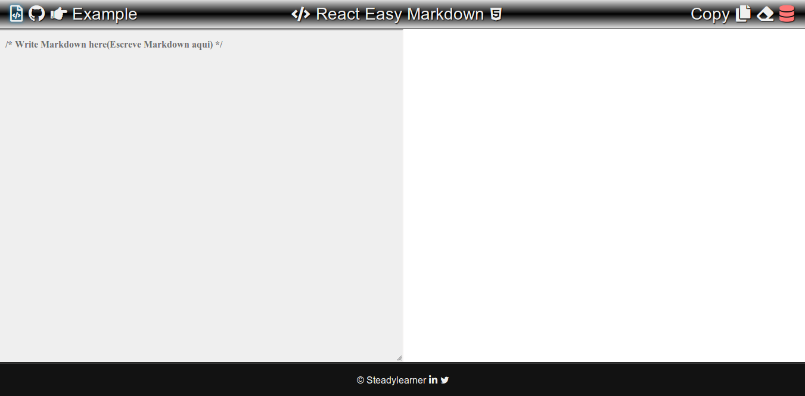

<!-- What I have to do later -->
<!--
  1. Update outdated packages and write your own package.json
  2. Organize folder structure to use Jest and Enzyme 
  3. Write some tests
  4. Include real example from https://www.steadylearner.com/markdown
-->

<!-- Shortcut -->

[react-marked-markdown]: https://github.com/Vincent-P/react-marked-markdown
[React Easy Markdown Github Repository]: https://github.com/steadylearner/react-easy-md
[examples]: https://github.com/steadylearner/react-easy-md/tree/master/examples
[Codesandbox for react-easy-md]: https://codesandbox.io/s/wz9pp1xpn8
[How to enable code syntax highlight in React App]: https://medium.com/@steadylearner/how-to-enable-code-syntax-highlight-in-react-app-38463498fa6e
[How to write less code for links in markdown with React]: https://www.steadylearner.com/blog/read/How-to-write-less-code-for-links-in-markdown-with-React
[marked]: https://github.com/markedjs/marked

<!-- \Shortcut -->

<!-- Steadylearner -->

[Steadylearner]: https://www.steadylearner.com/
[Blog]: https://www.steadylearner.com/blog
[Markdown]: https://www.steadylearner.com/markdown
[prop-passer]: https://www.npmjs.com/package/prop-passer

<!-- \Steadylearner -->

<!-- []() -->

 [](https://badge.fury.io/js/react-easy-md) []()

# React Easy Markdown(react-easy-md)

It will help you to write Markdown with React easily.

---

<!-- It turns it to absolute path at NPM -->

[](https://github.com/steadylearner/react-easy-md/tree/master/examples/react-easy-markdown-example)

The original code used here was from [react-marked-markdown][react-marked-markdown].

But the differences are 

1. It solved the problem of showing `null` title.
2. `prefixAndReplacement` prop is included to help you write shortcuts for `<a>` inside markdown.
3. The modules used here became funtional compomnents.
4. LiveMarkdownEditor is removed from the package to reduce package size and refer to [example code][examples] from [Markdown Editor Page][Markdown] at [Steadylearner][Steadylearner] instead if you want a working example. 
5. You can use **API** such as **copy(ToClipBoard)**, **html** and **makrdown**.

To explain more about `1.`, You can define title in Markdown with a code such as
`[Website](https://www.steadylearner.com/ "Website")`.

But having default value solves the problem of showing **null** title when users forget to define it or when you get data from the other websites that doesn't have title value with `<a>` tag.

It will also be convenient to have default values to save your time and space in .md file.

The original Github repository is archived so this package was made to share the code from the former repository with some improvements. 

The name of package became "react-easy-md" for the NPM Package didn't allow "react-easy -markdown" for similarity.

(You may think that React Easy Mardkdown refer to `react-easy-md` in this documentation.)

For [Steadylearner][Steadylearner] uses markdown intensively, it may include more features later.

## Install

1. Type `$npm install --save react-easy-md` or `$yarn add react-easy-md` in your **CLI**
2. Import component(s) you want
```js
import { MarkdownPreviw, MarkdownInput, html, markdown, copy } from 'react-easy-md';
```

3. If you use **webpack** and see some warnings and errors with this package, you may include

```js
// Refer to webpack.config.js at
// https://github.com/steadylearner/react-easy-md/blob/master/examples/config/webpack.config.js

// Remove errors in developement
const FilterWarningsPlugin = require('webpack-filter-warnings-plugin');
// For production mode work, use it instead of uglifyjsplugin
const TerserPlugin = require('terser-webpack-plugin'); //

moudle.exports = () => {
  return({
    module: {

      rules: [
	 {// to exclude source map error from third part libraires.
	  test: /\.(js|jsx)$/,
          exclude: /node_modules/,
	  use: ["source-map-loader"],
	  enforce: "pre",
	 },
      ], 
				
      
      node: {
	    fs: "empty",
	    tls: "empty",
	    net: "empty",
	    child_process: "empty",
      },
 
      optimization: {
        minimizer: [new TerserPlugin()],
      },

      // To remove warning from 'jsdom' used inside react-easy-md 
      plugins: [
        new FilterWarningsPlugin({
	      exclude: /Critical dependency: the request of a dependency is an expression/,
	}),
      ],

    }
  })
}

// If you have problem with TypeScript .ts file,
// you should find how to enable it in your webpack configuration
// and would contribute the file to this respository.
```

## Version Specific

1. **react-easy-markdown-example** at [examples][examples] to help you test it locally.
2. **markdown** function is included.

## Example

You may read [How to enable code syntax highlight in React App] if you want to use many code snippets inside your app or visit [react-marked-markdown][react-marked-markdown] for more information.

Every props used here is optional but it will be a starting point for your app. You can use **CSS** files in [examples folder][examples].
 
```js
// index.js
import React from "react";
import ReactDOM from "react-dom";
import { MarkdownPreview, copy, html, markdown } from "react-easy-md";

// Refer to www.steadylearner.com/markdown page
import example from "./example"; // use example instead not to be confused with jest tests
import "./styles.css";

function App() {
  // console.log(html(test)); // or use {markdown(html(test)) }
  const website = "https://www.steadylearner.com";
  return (
    <section className="App">
      <MarkdownPreview
        value={html(example)} // for we eallow sanitize false and allow html, it should show the same result
        // value={markdown(html(example))}
        markedOptions={{
          langPrefix: "hljs ", // hljs prefix for react-easy-md has its code part to used with it 
          sanitize: false, // allow html
          breaks: true,
        }}
        prefixWithReplacement={[
          // use absolute path to title attribute work well
          ["s-", `${website}`],
          ["l-", "https://www.linkedin.com/in"],
          ["y-", "https://www.youtube.com/channel/"],
          ["t-", "https://twitter.com/"],
          ["compare-", `${website}/blog/read`],
          ["g-", "https://www.github.com"]
        ]} // You can define multiple shortcuts for links in markdown
      />
      <button onClick={() => copy(html(example))} >Copy</button>
      {/* <br /> */}
      <span className="blue"> and paste it to <a href="www.steadylearner.com/markdown">www.steadylearner.com/markdown</a></span>
      {/* <section>{html(example)}</section> */}
    </section>
  );
}

const rootElement = document.getElementById("root");
ReactDOM.render(<App />, rootElement);


```

## API

1. You can refer to [react-marked-markdown][react-marked-markdown] first for this is just the improved version of it and [marked][marked] for main api here is from it.
2. To understand **prefixWithReplacement** better, please visit [How to write less code for links in markdown with React][How to write less code for links in markdown with React].

### Usage of prefixWithReplacement

The part of the code snippet from the example above
```jsx
prefixWithReplacement={[
  ["s-", "https://www.steadlyearner.com"],
  ["l-", "https://www.linkedin.com/in"],
  ["y-", "https://www.youtube.com/channel/"],
  ["t-", "https://twitter.com/"],
  ["g-", "https://www.github.com"]
]} 
```

We pass various **prefixes** with **its replacements** with data type **array of arrays**.

Then, Inside `MarkdownPreview` module it will convert 
```md
[Blog](s-/blog)
[LinkedIn](l-/steady-learner-3151b7164)
[YouTube](y-/UCt_jsJOe91EVjd58kHpgTfw)
[Twittter](t-/steadylearner_p)
[Github](g-/steadylearner)

<!-- You can use it wherever you use link -->
<!-- [code]: s-/code "Steadylearner Code" -->
```
equal to

```md
[Blog](https://www.steadylearner.com/blog)
[LinkedIn](https://www.linkedin.com/in/steady-learner-3151b7164/)
[YouTube](https://www.youtube.com/channel/UCt_jsJOe91EVjd58kHpgTfw)
[Twittter](https://twitter.com/steadylearner_p)
[Github](https://github.com/steadylearner)
```

With `prefiexWithReplacement` from this package, **you don't have to type the entire paths anymore**. It helps you **not to repeat what you know they will do**.

### html and markdown

```js
// This is just to show how it works
import { html, markdown } from "react-easy-md";

const package = "# react easy md";
const HTML = html(package); // <h1 id="react-easy-md" >react easy md</h1>
const react-easy-md = markdown(HTML) // "# react easy md"

```

## What is Next?

1. **Tests**, **examples** and the webpage.
2. [Posts][Blog] to explain it at [Steadylearner][Steadylearner]

## Read More

1. [Steadylearner Blog Posts for examples][blog]
2. [prop-passer to help you write less prop and className][prop-passer]

## Where to learn and use markdown?

 [Markdown-Tutorial]: https://www.markdowntutorial.com/

 1. [Start with Markdown-Tutorial][Markdown-Tutorial]
 2. [Markdown CheatSheet](https://github.com/adam-p/markdown-here/wiki/Markdown-Cheatsheet)
 3. [Use mark down for Github page](https://help.github.com/articles/getting-started-with-writing-and-formatting-on-github/)
 4. [Learn Markdown in X Minutes](https://learnxinyminutes.com/docs/markdown)
 5. [Steadylearner Markdown Live Editor][markdown]
 6. [Markdown to html](https://markdowntohtml.com/)
 7. [Markdown Interpreter](https://dillinger.io/)

